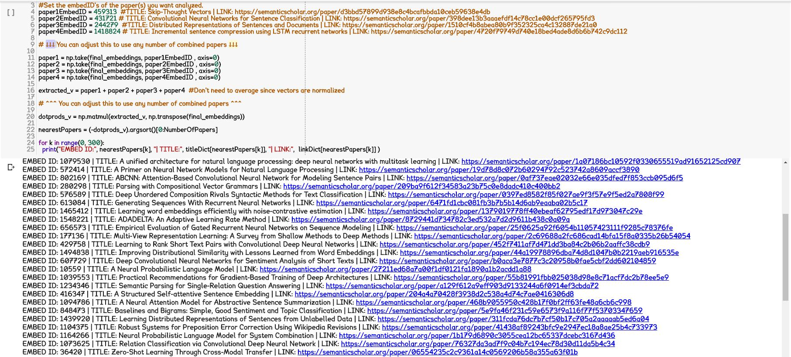
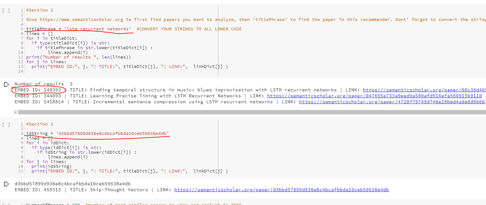

# Research2Vec

Upcoming project for representing research papers as vectors / latent representations. More coming soon 

I've created a subreddit to interact with users for this project

## What is it?

The dataset used is Semantic Scholar's corpus of research paper (https://labs.semanticscholar.org/corpus/ ), and was trained by a Word2Vec-based algorithm to develop an embedding for each paper. The database contains 1,666,577 papers, mostly in the computer science field. You can put 1 or more (as many as you want) papers and the recommender will return the most similar papers to those papers. You can also make TSNE maps of those recommendations.

## What are other research papers reccomenders and how do they compare to yours?

As far as I know:

For machine learning / cs there is http://www.arxiv-sanity.com/ which uses tf-idf vectors based on the contents of the papers

Other major ones are https://www.semanticscholar.org/ , https://scholar.google.com/ , and https://www.mendeley.com . 

I'm not sure exactly how they work but I'm guessing it's a combination of collaborative filtering, content based filtering, and graph-based reccomendations. I have not seen any indication that they are using embedding representations to represent whole papers. 

What I am hoping to see is if my recommender can recommend a paper that's very relevant, but not included in the recommendations of the first 3 recommenders I mentioned. If this can do this consistently, then it would be a worthy recommender to utilize in addition of the other 3.

## Why vector representation?

My last project in representing books as vectors worked out pretty well 
https://github.com/Santosh-Gupta/Lit2Vec

One of the advantages of having items representated as a vector is that not only can you get reccomendations for a particular items, but you can see how the reccomendations are related to each other. 

(book image from lit2vec here)

You can also just check out a particular field and see the intersections of two fields. 

(book image from lit2vec here)

Also, embeddings can have arithmetic properties
https://www.youtube.com/watch?time_continue=25&v=IbI2RJLxGZg

Although these properties were not robust in Lit2Vec although not entirely absent

(book image from lit2vec here)

But I'm hoping to improve upon lit2vec's arithmetic properties in the future with more data. 

In addition to the features of embeddings, just having a completly different system of research papers reccomendations can be benificial because if it can find even 1 paper that the other reccomenders didn't find, that alone may have a strong positive impact on the user. As someone who has conducted many thorough research paper searches, every single paper mattered. 

## How helpful are research paper reccomenders?

When I was in R&D, we spent a lot of time reinventing the wheel; a lot of techniques, methods, and processes that we developed we already pioneered or likely pioneers because, it's just that we weren't able to look for them, mainly due to not hitting the right keyword/phrasing in our queries.

There's a lot of variation in terms which can make finding papers for a particular concept very tricky at times.

I've seen a few times someone release a paper, and someone else point out someone has implemented very similar concepts in a previous paper.

Even the Google Brain team has trouble looking up all instances of previous work for a particular topic. A few months ago they released a paper of Swish activation function and people pointed out others have published stuff very similar to it.

>"As has been pointed out, we missed prior works that proposed the same activation function. The fault lies entirely with me for not conducting a thorough >enough literature search. My sincere apologies. We will revise our paper and give credit where credit is due."

https://www.reddit.com/r/MachineLearning/comments/773epu/r_swish_a_selfgated_activation_function_google/dojjag2/

So if this is something that happens to the Google Brain team, not being able to find all papers on a particular topic is something all people are prone too.

Here's an example of two papers whose authors didn't know about each other until they saw each other on twitter, and they posted papers on nearly the exact same idea, which afaik are the only two papers on that concept.

Word2Bits - Quantized Word Vectors

https://arxiv.org/abs/1803.05651

Binary Latent Representations for Efficient Ranking: Empirical Assessment

https://arxiv.org/abs/1706.07479

Exact same concept, but two very different ways of descriptions and terminology.

## How many papers does your reccomender cover?

This first version contains 1666577 papers in computer science, and each paper has embedding has a length of 80. I have data from about 40 million papers (in computer science, nueroscience, and biomedical sciences), and the optimal embedding size is probably at least 200-300 (which is the case for word embeddings) but I am limited by my computational resources (Google Colaboratory) so I'm starting with this limited version. I hope I can get funding for larger computational resources so that I can include more papers and larger embeddings. 

## What can you do with it ?

You can input a paper, and see what are the most similar papers to it, though the first 30-80 will most likely be papers it has cited or was cited by. I've set it to return 300 papers but it ranks all 1,666,577 papers so you can set it to return whatever number of papers you want without any change in performance (except when it comes to developing the TSNE maps)

Now, the fun part: utilization the embedding properties:

You can see a TSNE map of how those similar papers are related to each other. The TSNE takes a while to process for 500 points (10-20 minutes). You can decrease the number of papers for a speedup, or increase the number of papers but that'll take more time.

You can input several papers by adding the embeddings, and get recommendations for combined papers, just add the embeddings for all the papers (you don't have to average them since the embeddings are normalized ).

Finally, my favorite part, you can get TSNE maps of the recommendations for the combined papers are well.

A great use case would be if you're writing a paper, or plan to do some research and would like to check if someone has already done something similar. You can input all the papers you cited or would like to cite, and look over the recommendations.

## How do I use it ?

I tried to make this user friendly and as fast to figure out and run as possible, but there's probably stuff I didn't take into account. Let me know of you have any questions on how to run it or any feedback. If you want, you can just give me what papers you want to analyze and I'll do it for you (look up the papers on https://www.semanticscholar.org/ first )

Here's a step by step guide to help people get started

**Step 1:** 

Run the Section 1 of code in the Colab notebook. This will download the model and the dictionaries for the titles, Ids, and links. 

**Step 2:**

Find the papers want to find similar papers for at Semantic Scholar https://www.semanticscholar.org

Get either the title or Semantic Scholar's paperID, which is the last section of numbers/letters in the link. For example, in this link

https://www.semanticscholar.org/paper/Distributed-Representations-of-Sentences-and-Le-Mikolov/9abbd40510ef4b9f1b6a77701491ff4f7f0fdfb3

The Semantic Scholar paper ID is '9abbd40510ef4b9f1b6a77701491ff4f7f0fdfb3'

Use the title(s) and/or Semantic Scholar's paperID(s) with Section 2 and Section 3 to get the EmbedID from the model. EmbedIDs are how the model keeps track of each paper (not the paperID). If using the title to search, don't forget to use only lower case letters only. 

The EmbedID is what each dictionary first returns. 

**Step 3:**

Insert the EmbedID(s) as the values of paper1EmbedID, paper2EmbedID, paper3EmbedID, paper4EmbedID, etc. 

If you have less than or more than 4 papers you want to analyze, change this line 

`extracted_v = paper1 + paper2 + paper3 + paper4`

and create or eliminate the lines of code for vector extraction

    paper1 = np.take(final_embeddings, paper1EmbedID , axis=0)   
    paper2 = np.take(final_embeddings, paper2EmbedID , axis=0) 
    paper3 = np.take(final_embeddings, paper3EmbedID , axis=0)   
    paper4 = np.take(final_embeddings, paper4EmbedID , axis=0) 

Finally, run Section 4 to get a TSNE map of the recomendations. With 300 papers, it takes 15-18 minutes for the map to be produced. 

**Ask any question you have no matter how minor, I want people to use this as quickly as possible with as little time as possible figuring out what to do.** 

## Other details

So it probably doesn't have any papers released in the last 5 months; I think the corpus was last updated in May 2018. Due to the limitation on my computational resources (Google Colab) I had to filter towards more papers with more connections to other papers in the database. A connection is either a citation to another paper in the database, or cited by another paper in the database. I filtered to only include papers with 20 or more connections because Colab would crash if I tried to include more.

As of right now, the recommender has 1,666,577 papers. I hope to make future versions with more many more papers, including papers from other fields.

## Feedback greatly appreciated !

I am hoping to get as much feedback as possible. I am specifically looking for cases where you feel that the recommender should have given a particular paper in the top results, but didn't. I am hoping to make an evaluation toolkit (kinda like Facebook SentEval https://github.com/facebookresearch/SentEval ) that I can use to tune the hyperparameters.

Of course, I would very much appreciate whatever feedback, questions, comments, thoughts you have on this project.

## More info, discussions

Visit my subreddit for this project

https://www.reddit.com/r/Research2Vec/

You can also follow my Reddit username for this project

https://old.reddit.com/user/Research2Vec/
