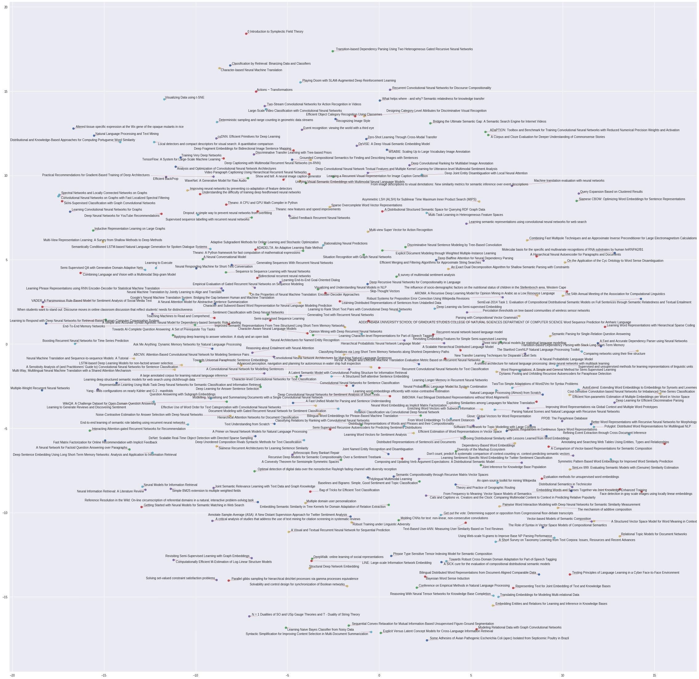
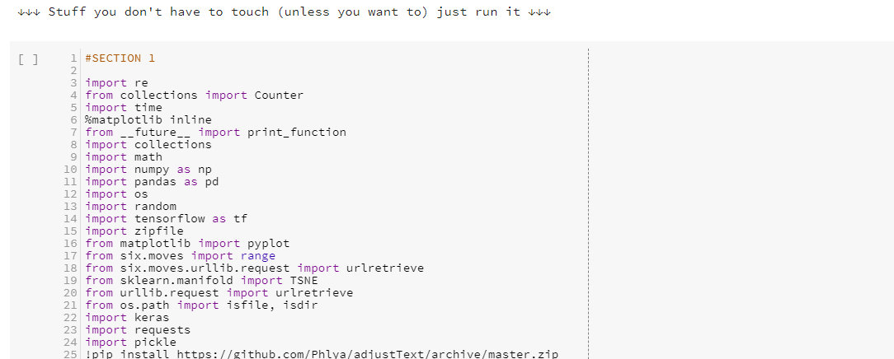
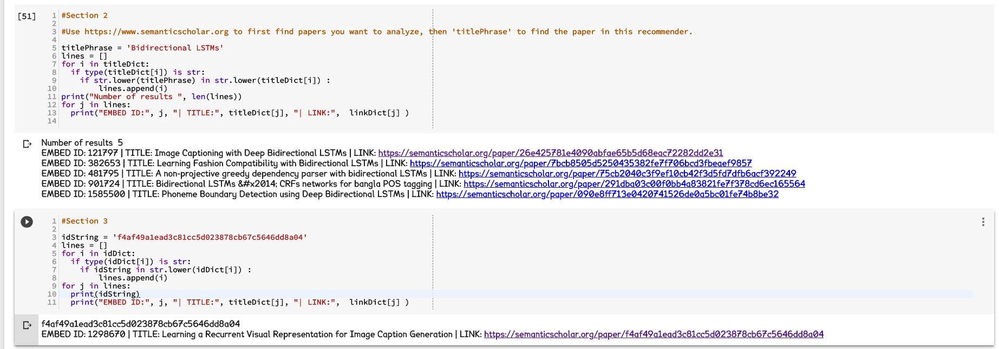

# Research2Vec

-------------------------------------------------------------------------
### Latest Update: 9-21-18 (previous updates at the bottom)

I developed a much more improved version of my recommender thanks to all the feedback I got. Btw THANK YOU SO MUCH FOR THE INTEREST/FEEDBACK EVERYONE. I was retweeted by some prominant names in machine learning, and was the top voted post this week on reddit.com/r/machinelearning, and number 5 overall this month. 

I have gotten a lot of feedback, and also information and leads to further develop my recommender. From the feedback, I was able to greatly increase the quality of my results by calculating the similarity for all combinations for the input embeddings and softmax embeddings, of the input paper and recommended papers. I then returned papers with highest similarity from all four sets of similarity calculations. 

I suspected this would be the best approach when I did my book recommender project ( https://github.com/Santosh-Gupta/Lit2Vec ) but the input embeddings were very robust and I didn't notice much of a difference. Thanks to the feedback I gotten on this project, I now know this is the vastly more effective approach. 

Here's a directly link to the updated recommender https://github.com/Santosh-Gupta/Research2Vec/blob/master/Research2VecPublicPlayGroundVersion2.ipynb

If you want improved results for papers you looked up, email me at Research2Vec@gmail.com or post in my subreddit https://www.reddit.com/r/Research2Vec/

I have many more plans to build upon this recommender, and I use the feedback I get as an evaluation suite for my recommenders. I'm also good at finding papers in general ( I actually host features where I help people find papers https://www.reddit.com/r/MLPapersQandA/ ) , and I may be able to find you a paper on a particular topic you had in mind without the recommender, then use this case for my evaluation suite down the road. 

-----------------------------------------------------------------------------

This is a research paper recommender, which works by a vector representation of each of the research papers. It is ready for you to use! The Google Colab notebook will automatically download the Tensorflow model, all you have to do is input the paper(s) and explore the results. 

## What is it?

The dataset used is Semantic Scholar's corpus of research paper (https://labs.semanticscholar.org/corpus/ ), and was trained by a Word2Vec-based algorithm to develop an embedding for each paper. This recommender contains 1,666,577 papers, mostly in the computer science field. You can put 1 or more (as many as you want !) papers and the recommender will return the most similar papers to those papers. You can also make TSNE maps of those recommendations.

## What are other research papers reccomenders and how do they compare to yours?

For machine learning / cs there is http://www.arxiv-sanity.com/ which uses tf-idf vectors based on the contents of the papers

Other major ones are https://www.semanticscholar.org/ , https://scholar.google.com/ ,  https://www.mendeley.com, and https://academic.microsoft.com/ . 

They all seem to use combination of collaborative filtering, content based filtering,  graph-based reccomendations, as well as embeddings representations. However, I have not seen them take full advantage of the embedding representation, specifically vector arithmatic or 2D similarity maps (TSNE). 

What I am hoping to see is if my recommender can recommend a paper that's very relevant, but not included in the recommendations of the four recommenders I mentioned. If my recommender can do this consistently, then it would be a worthy recommender to utilize in addition of the other 3.

## Why vector representation?

My last recommender with representing books as vectors worked out pretty well 
https://github.com/Santosh-Gupta/Lit2Vec

One of the advantages of having items representated as a vector is that not only can you get reccomendations for a particular items, but you can see how the reccomendations are related to each other. You can also just check out a particular field and see the intersections of two fields. 

Also, embeddings can have arithmetic properties
https://www.youtube.com/watch?time_continue=25&v=IbI2RJLxGZg

Although these properties were not robust in Lit2Vec, but not entirely absent

But I'm hoping to improve upon lit2vec's arithmetic properties in the future with more data. 

In addition to the features of embeddings, just having a completly different system of research papers reccomendations can be benificial because if it can find even 1 paper that the other reccomenders didn't find, that alone may have a strong positive impact on the user. As someone who has conducted many thorough research paper searches, every single paper mattered. 

## How helpful are research paper recommenders?

When I was in R&D, we spent a lot of time reinventing the wheel; a lot of techniques, methods, and processes that we developed we already pioneered or likely pioneered.  The issue was that we weren't able to look for them, mainly due to not hitting the right keyword/phrasing in our queries.

There's a lot of variation in terms which can make finding papers for a particular concept very tricky at times.

I've seen a few times someone release a paper, and someone else point out someone has implemented very similar concepts in a previous paper.

Even the Google Brain team has trouble looking up all instances of previous work for a particular topic. A few months ago they released a paper of Swish activation function and people pointed out others have published stuff very similar to it.

>"As has been pointed out, we missed prior works that proposed the same activation function. The fault lies entirely with me for not conducting a thorough >enough literature search. My sincere apologies. We will revise our paper and give credit where credit is due."

https://www.reddit.com/r/MachineLearning/comments/773epu/r_swish_a_selfgated_activation_function_google/dojjag2/

So if this is something that happens to the Google Brain team, not being able to find all papers on a particular topic is something all people are prone too.

Here's an example of two papers whose authors didn't know about each other until they saw each other on twitter, and they posted papers on nearly the exact same idea, which afaik are the only two papers on that concept.

Word2Bits - Quantized Word Vectors

https://arxiv.org/abs/1803.05651

Binary Latent Representations for Efficient Ranking: Empirical Assessment

https://arxiv.org/abs/1706.07479

Exact same concept, but two very different ways of descriptions and terminology.

## How many papers does your reccomender cover?

This first version contains 1666577 papers in computer science, and each paper has embedding has a length of 80. I have data from about 40 million papers (in computer science, nueroscience, and biomedical sciences), and the optimal embedding size is probably at least 200-300 (which is the case for word embeddings) but I am limited by my computational resources (Google Colaboratory) so I'm starting with this limited version. I hope I can get funding for larger computational resources so that I can include more papers and larger embeddings. 

## What can you do with it ?

You can input a paper, and see what are the most similar papers to it, though the first 30-80 will most likely be papers it has cited or was cited by. I've set it to return 300 papers but it ranks all 1,666,577 papers so you can set it to return whatever number of papers you want without any change in performance (except when it comes to developing the TSNE maps)

Now, the fun part: utilization the embedding properties:

You can see a TSNE map of how those similar papers are related to each other. The TSNE takes a while to process for 500 points (10-20 minutes). You can decrease the number of papers for a speedup, or increase the number of papers but that'll take more time.

You can input several papers by adding the embeddings, and get recommendations for combined papers, just add the embeddings for all the papers (you don't have to average them since the embeddings are normalized ).

Finally, my favorite part, you can get TSNE maps of the recommendations for the combined papers are well.

A great use case would be if you're writing a paper, or plan to do some research and would like to check if someone has already done something similar. You can input all the papers you cited or would like to cite, and look over the recommendations.

## How do I use it ?

Here's a quick video demonstration:

https://youtu.be/tlutFm1meMs

I tried to make this user friendly and as fast to figure out and run as possible, but there's probably stuff I didn't take into account. Let me know of you have any questions on how to run it or any feedback. If you want, you can just give me what papers you want to analyze and I'll do it for you (look up the papers on https://www.semanticscholar.org/ first )

Here's a step by step guide to help people get started

**Step 1:** 

Run the Section 1 of code in the Colab notebook. This will download the model and the dictionaries for the titles, Ids, and links. 

**Step 2:**

Find the papers want to find similar papers for at Semantic Scholar https://www.semanticscholar.org

Get either the title or Semantic Scholar's paperID, which is the last section of numbers/letters in the link. For example, in this link

https://www.semanticscholar.org/paper/Distributed-Representations-of-Sentences-and-Le-Mikolov/9abbd40510ef4b9f1b6a77701491ff4f7f0fdfb3

The Semantic Scholar paper ID is '9abbd40510ef4b9f1b6a77701491ff4f7f0fdfb3'

Use the title(s) and/or Semantic Scholar's paperID(s) with Section 2 and Section 3 to get the EmbedID from the model. EmbedIDs are how the model keeps track of each paper (not the paperID).

The EmbedID is what each dictionary first returns. 

**Step 3:**

In Section 4, insert the EmbedID(s) as the values of paper1EmbedID, paper2EmbedID, paper3EmbedID, paper4EmbedID, etc. 

If you have less than or more than 4 papers you want to analyze, change this line 

`extracted_v = paper1 + paper2 + paper3 + paper4`

and create or eliminate the lines of code for vector extraction

    paper1 = np.take(final_embeddings, paper1EmbedID , axis=0)   
    paper2 = np.take(final_embeddings, paper2EmbedID , axis=0) 
    paper3 = np.take(final_embeddings, paper3EmbedID , axis=0)   
    paper4 = np.take(final_embeddings, paper4EmbedID , axis=0) 

Finally, run Section 5 to get a TSNE map of the recomendations. With 300 papers, it takes 15-18 minutes for the map to be produced. 

**Ask any question you have no matter how minor, I want people to use this as quickly as possible with as little time as possible figuring out what to do.** 

## Other details

It probably doesn't have any papers released in the last 5 months; I think the corpus was last updated in May 2018. Due to the limitation on my computational resources (Google Colab) I had to filter towards out papers with less than 20 connections. A connection is either a citation to another paper in the database, or cited by another paper in the database. I filtered to only include papers with 20 or more connections because Colab could not handle all the papers I had on Computer Science. 

As of right now, the recommender has 1,666,577 papers. I hope to make future versions with more many more papers, including papers from other fields.

## Feedback greatly appreciated !

I am hoping to get as much feedback as possible. I am specifically looking for cases where you feel that the recommender should have given a particular paper in the top results, but didn't. I am hoping to make an evaluation toolkit (kinda like Facebook SentEval https://github.com/facebookresearch/SentEval ) that I can use to tune the hyperparameters.

This feedback will also be helpful in my future plans, where I am planning on incorporating several other measures of similarity, and then use a attention mechanism to weight them for a final similarity. One method of content analysis I would really like to use is Contextual Salience https://arxiv.org/abs/1803.08493. Another was something another Redditor just pointed out is cite2vec https://matthewberger.github.io/papers/cite2vec.pdf

The most useful feedback are any papers you feel that should have been included in the top results, but weren't. Also, if you see any results that just look totally off, that would be helpful too. 

Of course, I would very much appreciate whatever feedback, questions, comments, thoughts you have on this project.

## More info, discussions, where to give feedback

Reddit Machine Learning subreddit discussion on this project

https://redd.it/9fxajs

Visit my subreddit for this project

https://www.reddit.com/r/Research2Vec/

You can also follow my Reddit username for this project

https://old.reddit.com/user/Research2Vec/

## Future Work

I would like to tune hyperparameters based on the feedback I get, for example trying to get particular papers in the top results of other particular papers. 

When I get more computational resources, I would like to include more papers in more scientific areas. Right now I have 1,666,577 papers in Computer Science, which is just a fraction of the total number of papers I have availible. But if I included more, Google Colab will crash because it runs out of RAM. The Semantic Scholar Corpus has over 39 million papers in CS, nueroscience, and biomedical sciences. 

Also with just the 1,666,577 papers, the max embedding size I can use is 80, where as most uses of embedding representation of embeddings have found to have an optimal length of 200-300. 

If you have any reccomendations for computational resources, let me know. I don't know a very powerful GPU, Colab's K80 works very well, I just need a lot more ram. Currently Colab has about 13 GB. 

As mentioned, I would like to incorporate other measures of similarity, such as content-based methods, and then perhaps incorporate an attention mechanism to weigh these measures for different tasks / queries. 

Using a combo like this would help in one of the reoccurring hard search cases I encountered in R&D, which was trying to look up parameters of a particular method, when the method itself is not the focus of the paper. I was just actually encountering this issue when doing my project. I wanting to know more about what optimal hyperparameters others have found when working with embedding representations. This may not be the main topic of the paper, but it may have been described in the methods section of the paper. But this is hard to search for since paper searches mainly focus on the main subjects of the paper.

Two methods I am currently very interested in incoporating are Contextual Salience https://arxiv.org/abs/1803.08493 and Cite2Vec  https://matthewberger.github.io/papers/cite2vec.pdf

## Contact

Research2Vec@gmail.com

------------------------------------------------------------------------------
Update: 9-18-18  

I uploaded the code that I used to train the embeddings.  

https://github.com/Santosh-Gupta/Research2Vec/blob/master/Research2VecTraining2.ipynb 

Let me know if you have any feedback on the way it was coded. I am looking for ways to train more and longer embeddings without crashing Google Colab. So far for 1,666,577 papers, the max embedding size is 80. At size 81 the training crashes. 

